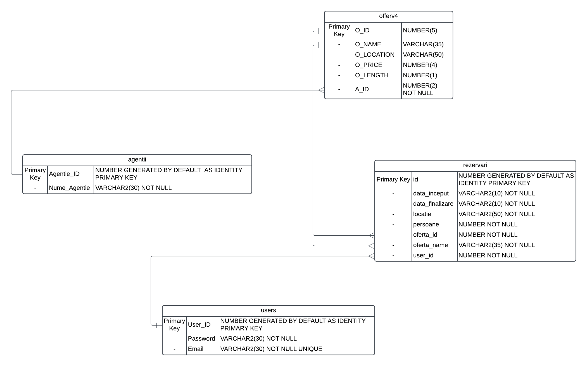

# Agentie de Turism
### Botiz Alexandru-Gabriel

## Descriere
Asta este o aplicatie clasica din care poti sa iti faci o rezervare pentru vacanta ta.

## Obiective
Folosirea limbajului Java, Bazelor de date

✔️ Sa fac aplicatia sa mearga intr-un mod basic folosind java.

✔️ Sa fac o interfata grafica pentru aplicatie.

✔️ Login si Sign Up screen

✔️ Sa folosesc o baza de date pentru a pastra datele rezervarilor si pentru a avea toate ofertele disponibile in ea.

❌ Sa adaug mobile support.

## Arhitectura
Diagrama Aplicatiei

## Functionalitati/Exemple utilizare
* Aplicația permite afișarea tuturor ofertelor disponibile
* Sortarea ofertelor dupa locatie si pret
* Rezervarea ofertei și anularea ofertei rezervate.

 Un exemplu ar fi : 
 Vrei sa rezervi o cabana la munte pentru o vacanta cu prietenii tai de cateva zile

### Resurse
Markdown Guide, [Online] Available: https://www.markdownguide.org/basic-syntax/ [accesed: Mar 14, 1706]

Site pentru realizarea diagramei : https://online.visual-paradigm.com/diagrams/features/component-diagram-software/
